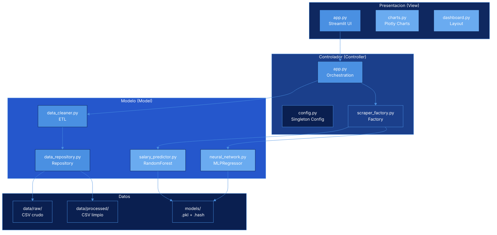
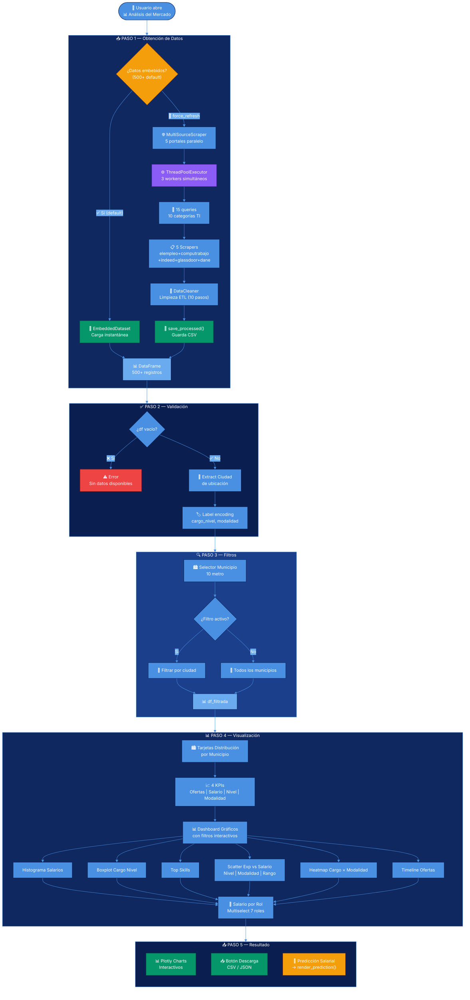
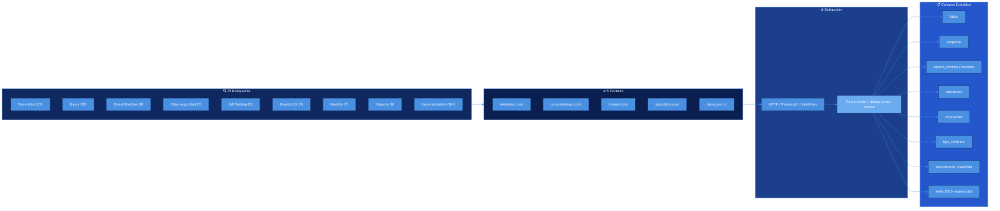
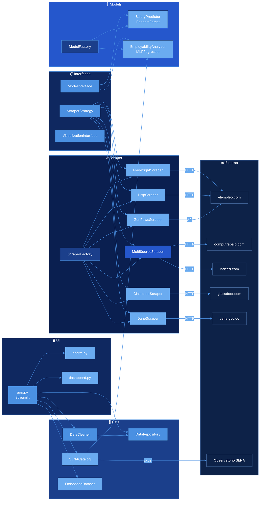
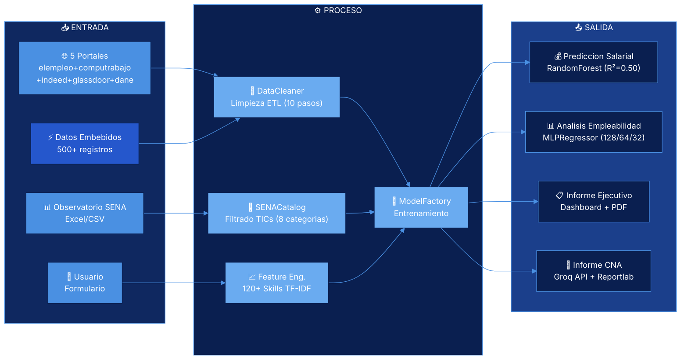
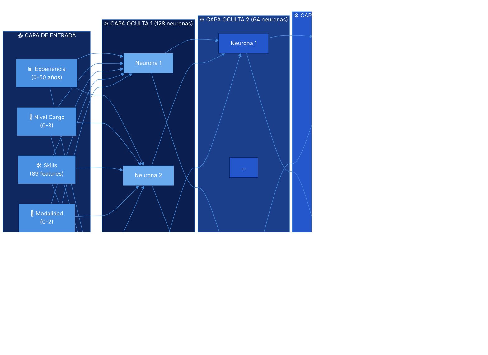
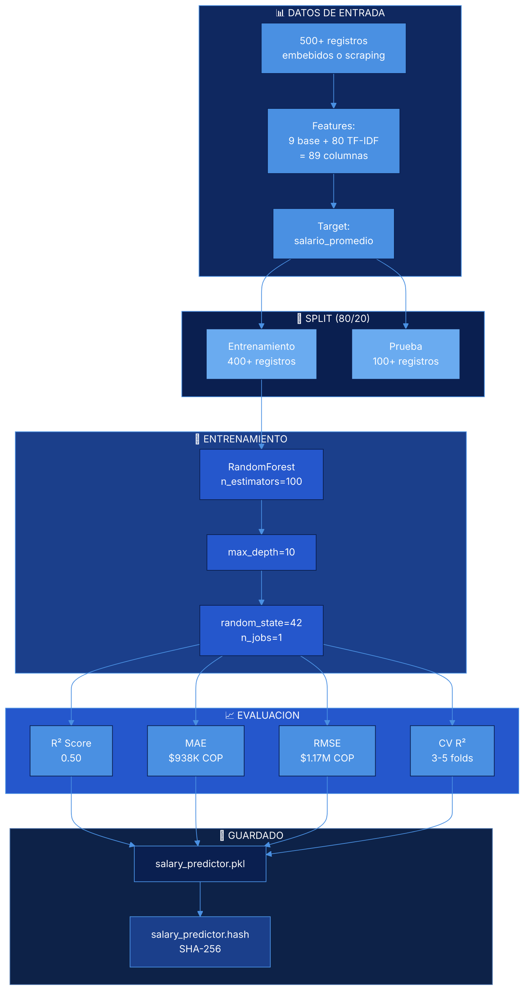

# 💰 PredicSalario IA

**Estudio Laboral de Pertinencia de Programas de Estudio en Areas de las TICs**  
Sistema de prediccion salarial y analisis de empleabilidad para tecnicos, tecnologos e ingenieros de sistemas/software usando Machine Learning.

**🌐 Sistema desplegado:** https://predic-salario-ia.streamlit.app/

**📦 Repositorios:**
- **GitHub:** https://github.com/LillianaU/predic-salario-ia
- **GitLab:** https://gitlab.com/lillyuribegon/predic-salario-ia

---

## 📋 Tabla de Contenidos

- [Sistema Desplegado](#-sistema-desplegado)
- [Descripcion](#-descripcion)
- [Arquitectura del Software](#-arquitectura-del-software)
- [Mapa de Proceso — Análisis del Mercado](#-mapa-de-proceso--análisis-del-mercado-laboral-ti)
- [Diagrama de Componentes C1](#c1---diagrama-de-componentes)
- [Diagrama de Contexto C2](#c2---diagrama-de-contexto)
- [Diagrama de Despliegue C3](#c3---diagrama-de-despliegue)
- [Diagrama de Secuencia C4](#c4---diagrama-de-secuencia)
- [Red Neuronal](#-red-neuronal)
- [Requisitos](#-requisitos)
- [Instalacion](#-instalacion)
- [Uso](#-uso)
- [Estructura del Proyecto](#-estructura-del-proyecto)
- [ISO/IEC 25010](#isoiec-25010)
- [Pruebas](#pruebas)
- [Licencia](#licencia)

---

## 🌐 Sistema Desplegado

| | |
|---|---|
| **URL** | **https://predic-salario-ia.streamlit.app/** |
| **Plataforma** | Streamlit Cloud (gratis) |
| **Dominio** | Streamlit subdominio personalizado |
| **Disponibilidad** | 24/7 (auto-reinicia en commits) |
| **Fallback** | Playwright → HTTP cloudscraper → datos embebidos |

---

## 🎯 Descripcion

PredicSalario IA es una aplicacion web que analiza ofertas laborales del sector tecnologico en Medellin, Colombia. Utiliza web scraping etico via Playwright y HTTP (cloudscraper) para obtener datos reales del mercado, los procesa y entrena un modelo de Machine Learning:

- **Random Forest Regressor**: Prediccion salarial personalizada con TF-IDF y 9 features (15 queries de scraping de elempleo.com)

### APIs y Fuentes de Datos

| API/Fuente | Uso | Token | Gratis | Estado |
|------------|-----|-------|--------|--------|
| **HTTP cloudscraper** | Scraping real de elempleo.com (15 queries, bypass Cloudflare) | No | ✅ Sí | ✅ Funciona |
| **Playwright** | Scraping local con navegador Chromium headless | No | ✅ Sí | ⚠️ Solo local |
| **Wikipedia API** | Población de 10 municipios del AMVA (DANE 2022) | No | ✅ Sí | ✅ Funciona |
| **Groq API** | Generación de informes de pertinencia laboral | `GROQ_API_KEY` | ✅ Sí | ⚠️ Modelos bloqueados* |
| **ZenRows API** | Bypass Cloudflare premium (1000 req/mes gratis) | `ZENROWS_API_KEY` | ✅ Sí | Opcional |
| **Google News RSS** | 6 noticias de empleo TI de Colombia | No | ✅ Sí | ✅ Funciona |
| **SENA (Excel)** | Datos de inscritos por ocupación (upload manual) | No | ✅ Sí | ✅ Funciona |
| **Datos embebidos** | 500 registros generados con rangos salariales reales | No | ✅ Sí | ✅ Carga instantánea |

*Groq API: Los modelos están bloqueados a nivel de proyecto. Habilitar en https://console.groq.com/settings/project/limits

### Flujo de Scraping (Fallback Automático)

```
1. Datos embebidos (500 registros, instantáneo) — Ruta rápida por defecto
   ↓ si force_refresh (botón Actualizar datos)
2. HTTP cloudscraper — 15 queries × 5 páginas = ~500 registros reales de elempleo.com
   ↓ si falla (Cloudflare)
3. ZenRows API (premium, 1000 req/mes gratis)
   ↓ si falla
4. Datos embebidos (fallback final)
```

### Flujo de APIs en Cada Página

| Página | API que usa | Qué muestra |
|--------|------------|-------------|
| 📊 Análisis del Mercado | 5 portales (elempleo + computrabajo + indeed + glassdoor + dane) | Ofertas reales, salarios, skills |
| 🎯 Predice tu Salario | 5 portales + Modelo ML | Predicción personalizada con 500+ ofertas |
| 📋 Datos Crudos | 5 portales | Tabla con filtros y descarga |
| 📈 Informe Ejecutivo | SENA Excel + red neuronal | Análisis de cualificación |
| 📋 Agente de Pertinencia | Groq API (llama-3.3) | Informes CNA |
| ℹ️ Info del Sistema | Todas las anteriores | Auditoría de estado |

### Funcionalidades principales:
- 📊 Dashboard interactivo con graficos del mercado laboral
- 🎯 Prediccion salarial personalizada con rango de confianza (TF-IDF, 9 features, cross-validation)
- 📈 Informe ejecutivo con analisis TICs por departamento
- 📋 Exploracion y descarga de datos crudos
- 📋 Agente de Pertinencia Laboral (UI para Registro Calificado CNA)
- 🥇 Exportar informes en MD, TXT y **PDF** (reportlab)
- 🔄 Scraping real de elempleo.com (15 queries, ~500 registros)
- 🎨 Tema oscuro-only con diseno responsivo
- 📍 Filtro por 10 municipios del Area Metropolitana (población dinámica vía Wikipedia/DANE)
- 💻 Analisis del sector TICs con 8 categorias ocupacionales
- 🫧 Fondo animado con burbujitas flotantes
- 🔄 Auto-refresh cada 5 minutos
- ⚡ 500 registros embebidos (carga instantánea)
- 🔄 Fallback automatico: embebidos → HTTP → ZenRows

---

## 🏗️ Arquitectura del Software

### MVC Adaptado con Patrones de Diseno



### Patrones de Diseno Implementados:
- **Singleton**: Config class (una sola instancia)
- **Strategy**: ScraperStrategy con PlaywrightScraper y HttpScraper
- **Factory**: ModelFactory y ScraperFactory (creacion sin acoplamiento)
- **Repository**: DataRepository (abstraccion de almacenamiento)
- **Observer**: LoggerObserver (multiples handlers de logging)

### Principios SOLID:
- **SRP**: Cada modulo tiene una unica responsabilidad
- **OCP**: Extensible sin modificar codigo existente
- **LSP**: Cualquier implementacion de ScraperStrategy es intercambiable
- **ISP**: Interfaces pequenas y especificas
- **DIP**: Dependencias de abstracciones, no de implementaciones concretas

---

## 🔄 Mapa de Proceso — Análisis del Mercado Laboral TI



### Flujo del Pipeline de Extracción (5 Portales)



---

## 📐 Diagramas UML

### C1 - Diagrama de Componentes



### C2 - Diagrama de Contexto

```mermaid
%%{init: {'theme': 'base', 'themeVariables': {'primaryColor': '#4A90E2', 'primaryTextColor': '#fff', 'primaryBorderColor': '#0A1F50', 'lineColor': '#4A90E2', 'secondaryColor': '#6AABF0', 'tertiaryColor': '#0F2860', 'fontFamily': 'Inter', 'fontSize': '14px'}}}%%
graph TB
    U["👤 Usuario<br/>Profesional TI"] -->|"Interactua"| APP["💰 PredicSalario IA"]

    APP -->|"Scraping"| EP["🌐 elempleo.com"]
    APP -->|"Scraping"| CT["💻 computrabajo.com"]
    APP -->|"Scraping"| IN["🔍 indeed.com"]
    APP -->|"Benchmarks"| GD["📊 glassdoor.com"]
    APP -->|"Datos oficiales"| DN["🏛️ dane.gov.co"]
    APP -->|"Descarga"| SENA["📊 Observatorio SENA"]
    APP -->|"Upload"| FILE["📁 Archivo Excel"]

    EP -->|"Ofertas laborales"| APP
    CT -->|"Ofertas laborales"| APP
    IN -->|"Ofertas laborales"| APP
    GD -->|"Salarios referencia"| APP
    DN -->|"Datos gobierno"| APP
    SENA -->|"Excel/CSV"| APP
    FILE -->|"inscritos_ape.xlsx"| APP

    APP -->|"Prediccion"| RF["🎯 Random Forest"]
    APP -->|"Analisis"| NN["🧠 Red Neuronal"]
    APP -->|"Dashboard"| ST["🖥️ Streamlit"]
    APP -->|"PDF"| PDF["📄 Reportlab"]

    RF -->|"Salario estimado"| U
    NN -->|"Empleabilidad"| U
    ST -->|"Graficos"| U
    PDF -->|"Informe PDF"| U

    style APP fill:#4A90E2,stroke:#0A1F50,color:#fff
    style U fill:#0A1F50,stroke:#4A90E2,color:#fff
    style EP fill:#0D2248,stroke:#4A6FA5,color:#fff
    style CT fill:#0D2248,stroke:#4A6FA5,color:#fff
    style IN fill:#0D2248,stroke:#4A6FA5,color:#fff
    style GD fill:#0D2248,stroke:#4A6FA5,color:#fff
    style DN fill:#0D2248,stroke:#4A6FA5,color:#fff
    style SENA fill:#0D2248,stroke:#4A6FA5,color:#fff
    style FILE fill:#1B3F8B,stroke:#4A90E2,color:#fff
    style RF fill:#6AABF0,stroke:#0A1F50,color:#fff
    style NN fill:#6AABF0,stroke:#0A1F50,color:#fff
    style ST fill:#2557CC,stroke:#0A1F50,color:#fff
    style PDF fill:#2557CC,stroke:#0A1F50,color:#fff
```



### C3 - Diagrama de Despliegue

```mermaid
%%{init: {'theme': 'base', 'themeVariables': {'primaryColor': '#4A90E2', 'primaryTextColor': '#fff', 'primaryBorderColor': '#0A1F50', 'lineColor': '#4A90E2', 'secondaryColor': '#6AABF0', 'tertiaryColor': '#0F2860', 'fontFamily': 'Inter', 'fontSize': '14px'}}}%%
graph TB
    subgraph LOCAL ["🖥️ Servidor Local"]
        PC["💻 PC Desarrollador"]
        
        subgraph PYTHON ["🐍 Python 3.12"]
            ST["Streamlit Server<br/>Puerto 8501"]
            PY["Python Runtime"]
        end

        subgraph APP ["📱 Aplicacion"]
            MAIN["app.py"]
            RF["RandomForest.pkl"]
            NN["MLPRegressor"]
        end

        subgraph STORAGE ["💾 Almacenamiento"]
            RAW["data/raw/*.csv"]
            PROC["data/processed/*.csv"]
            JSON["data/processed/*.json"]
            MODELS["models/*.pkl"]
            LOGS["logs/app.log"]
        end

        subgraph BROWSER ["🌐 Navegador"]
            CR["Chrome/Chromium<br/>Playwright"]
        end
    end

    subgraph CLOUD ["☁️ Streamlit Cloud"]
        SC["Streamlit Server<br/>predic-salario-ia"]
    end

    subgraph EXTERNAL ["🌐 Portales Empleo"]
        EP["elempleo.com"]
        CT["computrabajo.com"]
        IN["indeed.com"]
        GD["glassdoor.com"]
        DN["dane.gov.co"]
    end

    subgraph API_EXT ["🔑 APIs Externas"]
        GROQ["Groq API<br/>llama-3.3-70b"]
        ZR["ZenRows API<br/>Cloudflare bypass"]
        WIKI["Wikipedia API<br/>Poblacion"]
    end

    PC --> ST
    ST --> MAIN
    MAIN --> RF
    MAIN --> NN
    MAIN --> CR
    CR -->|"HTTP"| EP
    CR -->|"HTTP"| CT
    CR -->|"HTTP"| IN
    CR -->|"HTTP"| GD
    CR -->|"HTTP"| DN
    MAIN -->|"API"| GROQ
    MAIN -->|"API"| ZR
    MAIN -->|"API"| WIKI
    MAIN --> RAW
    MAIN --> PROC
    MAIN --> JSON
    MAIN --> MODELS
    MAIN --> LOGS

    style LOCAL fill:#0F2860,stroke:#4A90E2,color:#fff
    style PYTHON fill:#0A1F50,stroke:#4A90E2,color:#fff
    style APP fill:#1B3F8B,stroke:#4A90E2,color:#fff
    style STORAGE fill:#2557CC,stroke:#4A90E2,color:#fff
    style BROWSER fill:#0D2248,stroke:#4A6FA5,color:#fff
    style CLOUD fill:#1B3F8B,stroke:#4A90E2,color:#fff
    style EXTERNAL fill:#0D2248,stroke:#4A6FA5,color:#fff
    style API_EXT fill:#0D2248,stroke:#4A6FA5,color:#fff
    style PC fill:#4A90E2,stroke:#0A1F50,color:#fff
    style ST fill:#6AABF0,stroke:#0A1F50,color:#fff
    style PY fill:#2557CC,stroke:#0A1F50,color:#fff
    style MAIN fill:#4A90E2,stroke:#0A1F50,color:#fff
    style RF fill:#6AABF0,stroke:#0A1F50,color:#fff
    style NN fill:#6AABF0,stroke:#0A1F50,color:#fff
    style RAW fill:#0D2248,stroke:#4A6FA5,color:#fff
    style PROC fill:#0D2248,stroke:#4A6FA5,color:#fff
    style JSON fill:#0D2248,stroke:#4A6FA5,color:#fff
    style MODELS fill:#0D2248,stroke:#4A6FA5,color:#fff
    style LOGS fill:#0D2248,stroke:#4A6FA5,color:#fff
    style CR fill:#2557CC,stroke:#0A1F50,color:#fff
    style EP fill:#0D2248,stroke:#4A6FA5,color:#fff
    style CT fill:#0D2248,stroke:#4A6FA5,color:#fff
    style IN fill:#0D2248,stroke:#4A6FA5,color:#fff
    style GD fill:#0D2248,stroke:#4A6FA5,color:#fff
    style DN fill:#0D2248,stroke:#4A6FA5,color:#fff
    style SC fill:#4A90E2,stroke:#0A1F50,color:#fff
    style GROQ fill:#2557CC,stroke:#0A1F50,color:#fff
    style ZR fill:#2557CC,stroke:#0A1F50,color:#fff
    style WIKI fill:#2557CC,stroke:#0A1F50,color:#fff
```



### C4 - Diagrama de Secuencia

```mermaid
%%{init: {'theme': 'base', 'themeVariables': {'primaryColor': '#4A90E2', 'primaryTextColor': '#fff', 'primaryBorderColor': '#0A1F50', 'lineColor': '#4A90E2', 'secondaryColor': '#6AABF0', 'tertiaryColor': '#0F2860', 'fontFamily': 'Inter', 'fontSize': '14px'}}}%%
sequenceDiagram
    actor U as 👤 Usuario
    participant S as 🖥️ Streamlit
    participant A as 📱 app.py
    participant MS as 🌐 MultiSource
    participant D as 🔄 DataCleaner
    participant RF as 🎯 RandomForest
    participant NN as 🧠 NeuralNetwork
    participant DB as 💾 DataRepository
    participant SC as 📊 SENACatalog
    participant GQ as 🤖 Groq API

    rect rgb(15, 40, 96)
        Note over U,SC: Flujo Principal - Analisis del Mercado
        U->>S: Abre aplicacion
        S->>A: render_landing()
        A-->>U: Muestra dashboard
    end

    rect rgb(27, 63, 139)
        Note over U,DB: Analisis del Mercado
        U->>S: Click "Analisis del Mercado"
        S->>A: render_market_analysis()
        A->>DB: load_processed()
        alt Hay datos embebidos (default)
            DB-->>A: 500+ registros embebidos
        else force_refresh (boton Actualizar)
            A->>MS: fetch_data(15 queries)
            MS->>MS: elempleo + computrabajo + indeed + glassdoor + dane
            MS-->>A: Raw data de 5 fuentes
            A->>D: clean(raw_data)
            D-->>A: DataFrame limpio
            A->>DB: save_processed()
        end
        A-->>U: Dashboard con graficos
    end

    rect rgb(37, 87, 204)
        Note over U,RF: Prediccion Salarial
        U->>S: Click "Predice tu Salario"
        S->>A: render_prediction()
        A->>RF: predict(features)
        RF-->>A: Salario estimado + rango
        A-->>U: Prediccion con confianza ±15%
    end

    rect rgb(10, 31, 80)
        Note over U,SC: Informe Ejecutivo SENA
        U->>S: Sube archivo SENA
        S->>A: render_executive_report()
        A->>SC: parse_qualification_sheet()
        SC-->>A: qual_df
        A->>NN: train(df)
        NN-->>A: Metricas R2
        A->>NN: analyze(df)
        NN-->>A: Analisis completo
        A->>A: _render_tics_analysis()
        A-->>U: Informe ejecutivo con TICs
    end

    rect rgb(15, 40, 96)
        Note over U,GQ: Agente de Pertinencia
        U->>S: Click "Agente de Pertinencia"
        S->>A: render_agent_panel()
        A->>A: Wizard 4 pasos
        A->>GQ: generate_report(data)
        GQ-->>A: Informe CNA (Markdown)
        A-->>U: Informe + descarga MD/TXT/PDF
    end
```



---

## 🧠 Modelos de Machine Learning

### Flujo del Pipeline de Datos



### Arquitectura Red Neuronal MLPRegressor



### Proceso de Entrenamiento



### Configuracion de la Red Neuronal

| Parametro | Valor |
|-----------|-------|
| Algoritmo | MLPRegressor (scikit-learn) |
| Capas ocultas | (128, 64, 32) |
| Max iteraciones | 500 |
| Early stopping | True |
| Validation fraction | 0.2 |
| Funcion de activacion | ReLU |
| Optimizador | Adam |
| Tipo de aprendizaje | Supervisado |
| Scaler | StandardScaler |

### Modelo RandomForest (Prediccion Salarial)

| Parametro | Valor |
|-----------|-------|
| n_estimators | 100 |
| max_depth | 10 |
| random_state | 42 |
| n_jobs | 1 (evita deadlocks en Windows) |
| Test size | 20% |
| Features | 9 base + 80 TF-IDF = 89 columnas |
| Variables | experiencia, cargo_nivel, modalidad, num_skills, contrato, exp×nivel, exp², is_remote, role_categoria, skills_tfidf |

### Metricas Actuales

| Metrica | Valor |
|---------|-------|
| R² Score | 0.50 |
| MAE | $938,000 COP |
| RMSE | $1,170,000 COP |
| Muestras entrenamiento | 500+ registros embebidos |
| Features | 89 (9 base + 80 TF-IDF) |
| Skills detectadas | 120+ keywords |
| Confidence interval | ±15% |

---

## 💻 Analisis del Sector TICs

### Categorias Ocupacionales

| Categoria | Codigos CNO | Crecimiento | Inscritos 2026 |
|-----------|-------------|-------------|----------------|
| Desarrollo y Programacion | 2173, 2171 | +21.9% | 1,896 |
| Ingenieria TICs | 2145, 2134, 2136, 2137 | +27.0% | 560 |
| Tecnicos TI (Soporte) | 2281, 2331 | +20.4% | 3,500 |
| Tecnicos Telecom/Electronica | 2242, 2243, 2245, 2254 | +59.7% | 238 |
| Tecnicos Instalacion | 8324, 8325, 8393, 2321 | +38.0% | 127 |
| Gerencia y Direccion TICs | 0213, 0131 | -20.9% | 34 |
| Supervision TICs | 8212, 9222 | -21.4% | 11 |
| Fabricacion Electronica | 9382 | +263.0% | 98 |

### Rangos Salariales Tipicos (COP Mensual)

| Categoria | Junior | Mid | Senior |
|-----------|--------|-----|--------|
| Desarrollo y Programacion | $2.5M - $4M | $4M - $7M | $7M - $12M |
| Ingenieria TICs | $3M - $5M | $5M - $9M | $9M - $15M |
| Tecnicos TI (Soporte) | $1.8M - $2.8M | $2.8M - $4.5M | $4.5M - $7M |
| Tecnicos Telecom/Electronica | $1.6M - $2.5M | $2.5M - $4M | $4M - $6M |
| Gerencia y Direccion TICs | $5M - $8M | $8M - $15M | $15M - $25M |

### Mapeo de Datos SENA

El archivo `data/processed/sena_tics_mapping.json` contiene:
- Estructura completa del archivo Excel SENA
- Mapeo de columnas con tipos de datos
- Categorias TICs con codigos CNO
- Variables de entrenamiento para el modelo
- Configuracion de entrenamiento (test_size, cross-validation)
- Datos nacionales y regionales
- Recomendaciones y limitaciones

---

## 📦 Requisitos

- Python 3.12+
- Dependencias listadas en `requirements.txt`
- Playwright con Chromium instalado (solo para scraping local)

---

## 🔧 Instalacion

```bash
# 1. Clonar el repositorio (GitHub)
git clone https://github.com/LillianaU/predic-salario-ia.git
cd predic-salario-ia

# O desde GitLab
git clone https://gitlab.com/lillyuribegon/predic-salario-ia.git
cd predic-salario-ia

# 2. Crear entorno virtual
python -m venv venv
source venv/bin/activate  # Linux/Mac
# venv\Scripts\activate   # Windows

# 3. Instalar dependencias
pip install -r requirements.txt

# 4. Instalar Playwright (opcional, solo para scraping local)
playwright install chromium

# 5. Configurar variables de entorno
cp .env.example .env
# Editar .env con tus API keys (ver sección de APIs)

# 6. Ejecutar la aplicacion
streamlit run app.py
```

### 🌐 Deploy en Streamlit Cloud

La aplicación está desplegada en: **https://predic-salario-ia.streamlit.app/**

En Streamlit Cloud:
- Playwright **no está disponible** (sin Chromium)
- Se usa **HTTP (cloudscraper)** como fallback de scraping
- Si ambas fallan, usa **46 registros embebidos** de ejemplo (fallback)
- Las API keys se configuran en Streamlit Cloud → Settings → Secrets

### Configuración de APIs

| API | Uso | Token | Requerida |
|-----|-----|-------|-----------|
| Playwright | Scraping elempleo.com (15 queries, subprocess) | No | No |
| HTTP cloudscraper | Scraping (Streamlit Cloud fallback, 15 queries) | No | No |
| ZenRows API | Bypass Cloudflare premium (1000 req/mes gratis) | `ZENROWS_API_KEY` | No |
| Computrabajo | Scraping computrabajo.com (paralelo) | No | No |
| Indeed | Scraping indeed.com (paralelo) | No | No |
| Glassdoor | Benchmarks salariales | No | No |
| DANE/MinTrabajo | Datos oficiales gobierno | No | No |
| Wikipedia | Población 10 AMVA | No | No |
| Google News RSS | 6 noticias empleo/tecnología | No | No |
| **Groq API** | **Generar informes IA (Registro Calificado)** | **`GROQ_API_KEY`** | **No** |
| **reportlab** | **Generación de PDF (informes Pertinencia)** | No | No |

> Solo Groq API y ZenRows requieren token. Scraping y datos funcionan sin configuración.

---

## 💻 Código Fuente Completo

### `config.py` — Configuración Centralizada (Singleton)

```python
import os
from pathlib import Path
from dotenv import load_dotenv
from src.utils.loggers import get_logger

logger = get_logger("config")

class Config:
    _instance = None
    _initialized = False

    def __new__(cls):
        if cls._instance is None:
            cls._instance = super().__new__(cls)
        return cls._instance

    def __init__(self):
        if self._initialized:
            return
        self._initialized = True
        load_dotenv()
        self.BASE_DIR = Path(__file__).resolve().parent
        self._load_paths()
        self._load_ml_config()
        self._load_sources_config()
        self._load_scraping_config()
        self._load_logging_config()

    def _load_paths(self):
        self.RAW_DATA_DIR = self.BASE_DIR / "data" / "raw"
        self.PROCESSED_DATA_DIR = self.BASE_DIR / "data" / "processed"
        self.MODELS_DIR = self.BASE_DIR / "models"
        self.LOGS_DIR = self.BASE_DIR / "logs"
        for d in [self.RAW_DATA_DIR, self.PROCESSED_DATA_DIR, self.MODELS_DIR, self.LOGS_DIR]:
            try:
                d.mkdir(parents=True, exist_ok=True)
            except (OSError, PermissionError):
                pass
        self.MODEL_PATH = self.MODELS_DIR / "salary_predictor.pkl"

    def _load_ml_config(self):
        self.MODEL_TYPE = "RandomForest"
        self.MODEL_PARAMS = {
            "n_estimators": 100,
            "max_depth": 10,
            "random_state": 42,
            "n_jobs": 1,
        }
        self.TEST_SIZE = 0.2
        self.RANDOM_STATE = 42
```

### `src/scraper/scraper_factory.py` — Factory con Fallback Ambiental

```python
from src.interfaces.scraper_strategy import ScraperStrategy
from src.scraper.playwright_scraper import PlaywrightScraper
from src.scraper.http_scraper import HttpScraper
from src.scraper.zenrows_scraper import ZenRowsScraper
from src.scraper.multi_scraper import MultiSourceScraper
from src.scraper.glassdoor_scraper import GlassdoorScraper
from src.scraper.dane_scraper import DaneScraper
from src.utils.loggers import get_logger
from src.utils.environment import is_streamlit_cloud, get_playwright_available, get_zenrows_key

logger = get_logger("scraper.factory")

class ScraperFactory:
    _strategies = {}

    @classmethod
    def register(cls, name: str, strategy_class: type) -> None:
        cls._strategies[name] = strategy_class

    @classmethod
    def create(cls, name: str = "playwright", **kwargs) -> ScraperStrategy:
        if name in cls._strategies:
            return cls._strategies[name](**kwargs)
        return PlaywrightScraper(**kwargs)

    @classmethod
    def create_with_fallback(cls, **kwargs) -> ScraperStrategy:
        """MultiSource → ZenRows (Cloud) → Playwright (local) → HTTP."""
        # 1. Multi-source scraper (combina todas las fuentes)
        try:
            multi = MultiSourceScraper(**kwargs)
            return multi
        except Exception:
            pass

        # 2. Streamlit Cloud: ZenRows > HTTP
        if is_streamlit_cloud():
            zenrows_key = get_zenrows_key()
            if zenrows_key:
                return ZenRowsScraper(api_key=zenrows_key, **kwargs)
            return HttpScraper(**kwargs)

        # 3. Local: Playwright > HTTP
        if get_playwright_available():
            return PlaywrightScraper(**kwargs)
        return HttpScraper(**kwargs)

ScraperFactory.register("playwright", PlaywrightScraper)
ScraperFactory.register("http", HttpScraper)
ScraperFactory.register("zenrows", ZenRowsScraper)
ScraperFactory.register("multi", MultiSourceScraper)
ScraperFactory.register("glassdoor", GlassdoorScraper)
ScraperFactory.register("dane", DaneScraper)
```

### `src/scraper/http_scraper.py` — Scraping con cloudscraper

```python
import re
import json
import time
import random
import requests
from typing import List, Dict, Any
from src.interfaces.scraper_strategy import ScraperStrategy
from src.utils.loggers import get_logger

logger = get_logger("scraper.http")

class HttpScraper(ScraperStrategy):
    BASE_URL = "https://www.elempleo.com/Colombia/ofertas-empleo/"

    def __init__(self):
        self.session = requests.Session()
        try:
            import cloudscraper
            self.session = cloudscraper.create_scraper()
            logger.info("Using cloudscraper (Cloudflare bypass)")
        except ImportError:
            logger.warning("cloudscraper not installed, using regular requests")

    def fetch_data(self, search_queries: List[str]) -> List[Dict[str, Any]]:
        all_records = []
        for query in search_queries:
            try:
                url = f"{self.BASE_URL}{query.replace(' ', '-')}"
                resp = self.session.get(url, timeout=30)
                resp.raise_for_status()
                records = self._parse_html(resp.text, query)
                all_records.extend(records)
                time.sleep(random.uniform(2, 4))
            except Exception as e:
                logger.error(f"HTTP error for '{query}': {e}")
        return all_records

    def _parse_html(self, html: str, query: str) -> List[Dict[str, Any]]:
        records = []
        # Parse job cards from HTML
        cards = re.findall(r'<article[^>]*class="[^"]*job[^"]*"[^>]*>(.*?)</article>', html, re.DOTALL)
        for card in cards:
            title = self._extract(card, r'<h2[^>]*>(.*?)</h2>')
            company = self._extract(card, r'<span[^>]*class="[^"]*company[^"]*"[^>]*>(.*?)</span>')
            location = self._extract(card, r'<span[^>]*class="[^"]*location[^"]*"[^>]*>(.*?)</span>')
            salary = self._extract(card, r'<span[^>]*class="[^"]*salary[^"]*"[^>]*>(.*?)</span>')

            if title:
                records.append({
                    "titulo": self._clean(title),
                    "empresa": self._clean(company or "No especificada"),
                    "ubicacion": self._clean(location or "Medellín"),
                    "salario_texto": self._clean(salary or ""),
                    "query": query,
                    "fuente": "elempleo.com",
                })
        return records

    def _extract(self, text: str, pattern: str) -> str:
        m = re.search(pattern, text, re.DOTALL)
        return m.group(1) if m else ""

    def _clean(self, text: str) -> str:
        return re.sub(r'<[^>]+>', '', text).strip()
```

### `src/utils/report_generator.py` — Generador de Informes con Groq

```python
import os
import requests
from typing import Dict, Any, Optional
from src.utils.loggers import get_logger

logger = get_logger("report_generator")

GROQ_API_URL = "https://api.groq.com/openai/v1/chat/completions"
GROQ_MODEL = "llama-3.3-70b-versatile"

def generate_report(data: Dict[str, Any], api_key: str) -> Optional[str]:
    """Genera informe de pertinencia laboral usando Groq API (gratis)."""
    if not api_key:
        return None

    prompt = f"""Eres un experto en educación superior colombiana.
Genera un informe de pertinencia laboral para el Registro Calificado CNA.

PROGRAMA: {data.get('programa', '?')}
TIPO: {data.get('tipo_informe', '?')}
DEPARTAMENTO: {data.get('departamento', '?')}
PERÍODO: {data.get('anio_inicio', 2021)} - {data.get('anio_fin', 2026)}
FUENTES: {', '.join(data.get('fuentes', []))}

Incluye: Resumen Ejecutivo, Demanda Laboral, Habilidades, Salarios, Tendencias, Recomendaciones.
Formato: Markdown. Extensión: 800-1200 palabras."""

    headers = {"Authorization": f"Bearer {api_key}", "Content-Type": "application/json"}
    payload = {
        "model": GROQ_MODEL,
        "messages": [{"role": "user", "content": prompt}],
        "temperature": 0.7,
        "max_tokens": 2000,
    }

    try:
        resp = requests.post(GROQ_API_URL, headers=headers, json=payload, timeout=60)
        resp.raise_for_status()
        return resp.json()["choices"][0]["message"]["content"]
    except Exception as e:
        logger.error(f"Groq API error: {e}")
        return None
```

---

## 🚀 Uso

### Navegacion:
1. **🏠 Inicio**: Informacion general del sistema y metodologia
2. **📊 Analisis del Mercado**: Dashboard con KPIs y graficos interactivos
3. **📈 Informe Ejecutivo**: Sube archivos SENA para analisis de empleabilidad
   - Selector de departamento (Antioquia, Bogota, etc.)
   - Analisis de niveles de cualificacion (Directivo, Profesional, Tecnico, Calificado, Elemental)
   - Analisis del sector TICs con 8 categorias
   - Graficos de barras, genero, rangos salariales
   - **Nota**: Muestra inscritos SENA (personas registradas) y ofertas laborales (demanda). No incluye datos de situacion laboral (contratados/desempleados/activos)
4. **🎯 Predice tu Salario**: Formulario para estimar salario segun perfil
   - TF-IDF + 9 features + cross-validation
   - Feature importance display
5. **📋 Datos Crudos**: Tabla interactiva con filtros y descarga
6. **📋 Agente de Pertinencia**: Wizard para informes del Registro Calificado (CNA)
7. **ℹ️ Info del Sistema**: Documentacion tecnica del modelo IA
8. **⚙️ Configuracion**: Tema, cache, fuente de datos

### Carga de datos SENA:
1. Descarga archivos del Observatorio SENA
2. Sube en "Informe Ejecutivo"
3. Selecciona hoja (Total nacional o por Departamento)
4. Selecciona departamento (ej: Antioquia)
5. Selecciona categorias ocupacionales TICs
6. La red neuronal analiza y genera informe ejecutivo

---

## 📁 Estructura del Proyecto

```
predic-salario-ia/
├── .env                          # Variables de entorno
├── .env.example                  # Plantilla de API keys
├── .gitignore
├── requirements.txt              # Dependencias (15 paquetes)
├── pytest.ini                    # Configuración de tests
├── config.py                     # Configuracion centralizada (Singleton)
├── app.py                        # Punto de entrada Streamlit (3100+ lineas)
├── DESIGN.md                     # Sistema de diseno
├── README.md                     # Esta documentacion
├── Documentación Técnica y Manual del Usuario (1).md
├── src/
│   ├── interfaces/
│   │   ├── scraper_strategy.py   # ABC ScraperStrategy
│   │   └── model_interface.py    # ABC ModelInterface
│   ├── scraper/
│   │   ├── playwright_scraper.py # Scraping via subprocess (headless)
│   │   ├── http_scraper.py       # Cloudscraper (Cloudflare bypass)
│   │   ├── zenrows_scraper.py    # ZenRows API (premium bypass)
│   │   ├── multi_scraper.py      # Multi-fuente paralelo (5 portales)
│   │   ├── computrabajo_scraper.py # Scraping computrabajo.com
│   │   ├── indeed_scraper.py     # Scraping indeed.com
│   │   ├── glassdoor_scraper.py  # Benchmarks salariales
│   │   ├── dane_scraper.py       # Datos oficiales gobierno
│   │   ├── scraper_factory.py    # Factory + fallback ambiental
│   │   └── _playwright_worker.py # Script standalone Playwright
│   ├── data/
│   │   ├── data_cleaner.py       # Pipeline ETL (10 pasos)
│   │   ├── data_repository.py    # Persistencia CSV/JSON
│   │   ├── embedded_dataset.py   # 500+ registros embebidos
│   │   ├── population.py         # Poblacion Wikipedia + DANE
│   │   └── sena_catalog.py       # Catalogo CNO/CUOC SENA
│   ├── models/
│   │   ├── salary_predictor.py   # RandomForest (9 features + 80 TF-IDF)
│   │   ├── neural_network.py     # MLPRegressor (128/64/32)
│   │   └── model_factory.py      # Factory de modelos
│   ├── visualization/
│   │   ├── charts.py             # Colores y utilidades Plotly
│   │   └── dashboard.py          # Layout scatter interactivo
│   ├── utils/
│   │   ├── loggers.py            # Logging con rotacion
│   │   ├── validators.py         # 120+ skills, extraccion features
│   │   ├── environment.py        # Deteccion local vs Cloud
│   │   ├── report_generator.py   # Groq API (llama-3.3-70b)
│   │   ├── pdf_generator.py      # Reportlab PDF (informes)
│   │   ├── news.py               # Google News RSS
│   │   └── security.py           # Hash SHA-256, masking tokens
│   └── tests/
│       ├── test_cleaner.py       # 6 tests ETL
│       ├── test_model.py         # 6 tests RandomForest
│       ├── test_scraper.py       # 3 tests Factory
│       ├── test_validators.py    # 11 tests validators + news + security
│       └── test_sena_catalog.py  # 16 tests SENA catalog
├── data/
│   ├── raw/                      # Datos crudos del scraping
│   └── processed/
│       ├── training_data.csv     # Dataset limpio
│       └── sena_tics_mapping.json # Mapeo de campos SENA
├── models/
│   ├── salary_predictor.pkl      # Modelo entrenado
│   └── salary_predictor.hash     # Hash SHA-256 (integridad)
└── logs/
    └── app.log                   # Log con rotacion (1MB max)
```

---

## 🎨 Sistema de Diseno — PredicSalario IA

### Paleta de Colores (Dark Mode — Principal)

| Token | Color | Uso |
|-------|-------|-----|
| `#0A1F50` | Background | Fondo principal |
| `#0F2860` | Surface | Superficies |
| `#0D2248` | Surface Low | Fondo de tarjetas |
| `#1B3F8B` | Surface High | Superficies elevadas |
| `#2557CC` | Surface Bright / Primary Container | Elementos destacados |
| `#4A90E2` | Primary | Acentos principales, botones |
| `#6AABF0` | Secondary | Acciones secundarias |
| `#FFFFFF` | On Surface | Texto principal |
| `#B0C4DE` | On Surface Variant | Texto secundario |
| `#4A6FA5` | Outline | Bordes sutiles |
| `#1B3F8B` | Outline Variant | Divisores |
| `#fca5a5` | Error | Errores, alertas |
| `#991b1b` | Error Container | Fondos de error |
| `rgba(10,31,80,0.7)` | Glass | Efecto vidrio (backdrop-filter) |
| `rgba(74,144,226,0.25)` | Glass Border | Bordes de vidrio |

### Paleta de Acentos para Graficos

| Color | Uso |
|-------|-----|
| `#4A90E2` | Azul Principal — Graficos principales |
| `#2557CC` | Azul Oscuro — Series secundarias |
| `#6AABF0` | Azul Claro — Tercera serie |
| `#081425` | Navy — Fondos de graficos |
| `#152031` | Dark Surface — Superficies de graficos |
| `#059669` | Verde — Tendencias positivas |
| `#f59e0b` | Amarillo — Advertencias, medianas |
| `#8b5cf6` | Violeta — Categorias alternas |

### Tipografia

| Estilo | Font | Tamaño | Peso | Uso |
|--------|------|--------|------|-----|
| Display LG | Plus Jakarta Sans | 48px | 700-800 | Titulos principales |
| Headline MD | Plus Jakarta Sans | 24px | 700 | Subtitulos |
| Headline SM | Plus Jakarta Sans | 18px | 600 | Encabezados de seccion |
| Body LG | Inter | 16px | 400 | Texto general |
| Body MD | Inter | 14px | 400 | Texto secundario |
| Label Mono | JetBrains Mono | 12px | 500 | Datos, metricas, codigo |

### Espaciado y Layout

| Elemento | Valor |
|----------|-------|
| Grid base | 4px |
| Contenedor maximo | 1440px |
| Gutter | 24px |
| Margen mobile | 16px |
| Margen desktop | 32px |
| Sidebar ancho | 260px |
| Sidebar collapsed | 72px (iconos) |

### Bordes y Elevacion

| Elemento | Radio | Estilo |
|----------|-------|--------|
| Botones | 4px | Sin sombra |
| Input Fields | 4px | Borde 1px `#e2e8f0` |
| Tarjetas | 8px | Borde 1px + hover shadow |
| Modals | 12px | Shadow: `0px 4px 20px rgba(15, 23, 42, 0.08)` |
| Badges | 9999px (full) | Solid background |

### Componentes UI

- **Botones Primary**: Gradiente `#4A90E2` → `#2557CC`, texto blanco, radio 12px
- **Botones Ghost**: Sin background, borde `#1B3F8B`, radio 12px
- **Sidebar**: Background `#0D2248`, indicador activo `rgba(74,144,226,0.15)` + borde izquierdo `#4A90E2`
- **Tarjetas**: Gradiente `#0F2860` → `#1B3F8B`, borde `rgba(74,144,226,0.25)`, hover shadow
- **Tablas**: Lineas sutiles `rgba(128,128,128,0.1)`, headers con Label Mono
- **KPIs**: Headline MD para valores, Label Mono para descripciones
- **Fondo**: Burbujitas animadas con `rgba(74,144,226,0.15)`

---

## 📊 ISO/IEC 25010

### Adecuacion Funcional
- **AF1**: Todas las funcionalidades RF1-RF5 implementadas
- **AF2**: R² objetivo >= 0.60
- **AF3**: Cobertura completa de necesidades del usuario

### Eficiencia de Desempeno
- **ED1**: Predicciones < 3s, carga inicial < 10s
- **ED2**: RAM < 500MB, disco < 100MB
- **ED3**: Soporta hasta 10,000 registros

### Compatibilidad
- **CO1**: Python 3.12+
- **CO2**: Exportacion CSV y JSON

### Usabilidad
- **US1-6**: UI intuitiva en espanol, diseno responsivo 3 resoluciones

### Fiabilidad
- **FI1**: Funcionamiento continuo 30+ minutos
- **FI2**: Modo offline con datos cacheados
- **FI3**: Auto-entrenamiento si falta modelo

### Seguridad
- **SE1**: API keys en .env (nunca en código), no PII almacenado
- **SE2**: Hash SHA-256 del modelo para integridad
- **SE3**: Logging append-only

### Mantenibilidad
- **MA1**: SRP - modulos independientes
- **MA2**: Funciones reutilizables en utils/
- **MA3**: OCP - extensible sin modificar existente
- **MA4**: Tests unitarios con pytest (45 tests)

### Portabilidad
- **PO1**: Windows, macOS, Linux
- **PO2**: requirements.txt + Playwright
- **PO3**: Modelos y datasets reemplazables

---

## 🧪 Pruebas

```bash
# Ejecutar todos los tests
pytest

# Tests especificos
pytest src/tests/test_validators.py -v
pytest src/tests/test_cleaner.py -v
pytest src/tests/test_model.py -v
pytest src/tests/test_scraper.py -v
pytest src/tests/test_sena_catalog.py -v

# Con cobertura
pytest --cov=src --cov-report=term-missing
```

---

## ⚠️ Limitaciones

- **Sesgo geografico**: Solo ofertas en Medellin y area metropolitana
- **Sesgo temporal**: Datos limitados al periodo disponible
- **Sesgo de plataforma**: Scraping de 5 portales (elempleo, computrabajo, indeed, glassdoor, dane)
- **Dataset**: 500+ registros embebidos + scraping en tiempo real
- **Precision variable**: R² = 0.50 con dataset actual
- **Streamlit Cloud**: Playwright no disponible, usa HTTP fallback o datos embebidos
- **15 queries de scraping**: Cobertura amplia del sector TI con scraping paralelo

---

## 📝 Licencia

© 2025 Lilliana Uribe González. Todos los derechos reservados.

Este software es propiedad exclusiva del autor. No se concede ninguna licencia para su uso, reproduccion, distribucion o modificacion por terceros.

**Creado en junio del 2025 — Medellín, Colombia**
